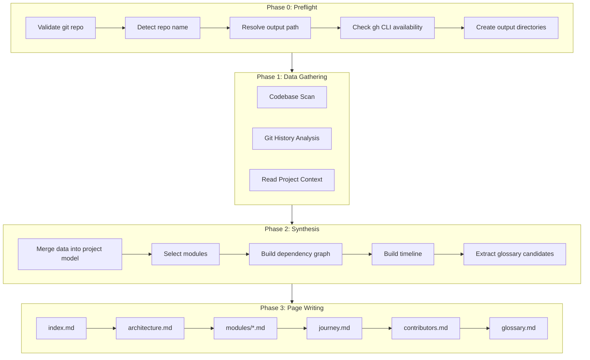

# Wiki Generator — Design

## Overview

This document describes the technical design for generating a multi-page wiki from any git repository. The process has four phases: preflight validation, data gathering, synthesis, and page writing.

---

## Architecture

The generator follows a pipeline architecture with parallel data collection feeding into a synthesis step, which then drives sequential page writing.

---

## Phase 0: Preflight Validation

Before any analysis, validate the environment:

1. **Verify git repository** — run `git rev-parse --is-inside-work-tree`. Abort if not a git repo.
2. **Determine repo name** — extract from `git remote get-url origin` (parse `org/repo-name` → `repo-name`). Fallback: basename of the working directory.
3. **Resolve output path** — use `--output <path>` if provided, otherwise `wiki/` at the repo root. If the directory already exists and `--force` was not passed, warn the user and stop.
4. **Check GitHub CLI** — run `which gh` and `gh auth status`. Record whether PR enrichment is available.
5. **Create output directories** — `mkdir -p <output>/modules`.

---

## Phase 1: Data Gathering

Three independent data collection tasks run in parallel.

### 1A: Codebase Scan

Analyze the repository structure to identify languages, modules, and dependencies.

**Steps:**
1. Glob for source files by extension. Count files per extension. Report the top 5 languages by file count.
2. Sample up to 20 representative source files with `wc -l` and extrapolate total LOC.
3. Detect modules using the heuristics in `references/module-detection.md` (strategies 1–4 in priority order).
4. For each module: record name, path, file count, entry point file, and a one-sentence description.
5. Note presence of key configs: Dockerfile, docker-compose.yml, CI configs, infrastructure files.
6. Grep for import/require statements between modules to build a dependency map.

**Output:** structured report with languages, LOC, module list, config presence, and inter-module dependencies.

### 1B: Git History Analysis

Analyze the full git history to build a narrative timeline.

**Steps:**
1. Run the core git commands listed in `references/git-analysis.md` to extract: total commits, project date range, tags, contributor stats, merge commits, and branch info.
2. Extract PR numbers from merge commit messages (patterns: `Merge pull request #N`, `(#N)` in squash merges).
3. If `gh` is available and authenticated: fetch full details for the top 20 PRs via `gh pr view`.
4. Group commits into epochs following `references/git-analysis.md` epoch grouping logic (tag-based if tags exist, time-based otherwise).
5. Identify the 5–10 most significant events (tagged releases, major merges, first commit).

**Output:** structured report with project metadata, epochs, tags, contributors, notable PRs, and branches.

### 1C: Project Context

Read contextual files from the repo root:
- `README.md` (or `.rst`, `.txt` variant)
- `CLAUDE.md` if present
- `LICENSE` or `LICENSE.md` (extract license type)
- `CONTRIBUTING.md` if present (extract development workflow info)

---

## Phase 2: Synthesis

Merge the three data sources into a unified project model.

1. **Module selection** — modules with fewer than 3 source files are mentioned in architecture.md but do not get their own page. If total modules > 15, keep only the top 15 by file count.
2. **Dependency graph** — from the codebase scan's import analysis, build the adjacency list for the Mermaid diagram.
3. **Timeline** — from the git historian's epochs, select the narrative thread for journey.md.
4. **Glossary candidates** — collect domain-specific terms that appeared frequently (class names, service names, custom types, abbreviations).
5. **Tiny repo check** — if the repo has fewer than 5 source files, skip the `modules/` directory entirely and fold module info into architecture.md.

---

## Phase 3: Page Writing

Write pages sequentially using the templates in `references/page-templates.md`.

| Page | Key Content | Template Section |
|------|-------------|-----------------|
| `index.md` | Project name, summary, quick stats table, table of contents, getting started | `index.md` template |
| `architecture.md` | System overview, component diagram (flowchart TD), dependency graph (graph LR), design decisions, data flow (sequence diagram), external dependencies table | `architecture.md` template |
| `modules/<name>.md` | Module summary, key files table, public API listing, internal flow diagram (flowchart), dependency links | `modules/module-name.md` template |
| `journey.md` | Opening stats, epoch narratives (past tense, third person), key events, gitGraph, release history table, notable PRs | `journey.md` template |
| `contributors.md` | Top contributors table, contribution pattern observations | `contributors.md` template |
| `glossary.md` | Term/definition/location table | `glossary.md` template |

---

## Phase 4: Finalization

1. **Verify cross-links** — confirm every relative link between wiki pages resolves to an existing file.
2. **Register the wiki in `CLAUDE.md`** — so future agent sessions discover and use the generated wiki, point the project's root `CLAUDE.md` at it (using the resolved `<output>` path, default `wiki/`):
   - If `CLAUDE.md` does **not** exist at the repo root, create it with a `## Repository context` section instructing readers to use the local `wiki/` for repo context: start at `wiki/index.md`, read `wiki/architecture.md` for system design, `wiki/modules/<name>.md` for a specific module, and `wiki/journey.md` for the history behind a decision, and regenerate after significant changes.
   - If `CLAUDE.md` **does** exist, read it first and do not overwrite it. If it already references the wiki, leave it unchanged; otherwise append the `## Repository context` section to the end, preserving all existing content.
3. **Report to user** — list created pages, total word count, any skipped pages with reasons, and the output location.

---

## Writing Style Conventions

All wiki pages follow these rules:

- **First sentence:** Bold the project/module name. State what it is and does in one sentence.
- **Tone:** Neutral, encyclopedic, third-person. Never use "you", "we", "I".
- **Tense:** Present tense for descriptions ("The API module handles..."). Past tense for history ("Version 1.0 was released on...").
- **Cross-links:** Relative links between wiki pages. Format: `[Page Title](relative-path.md)`.
- **Mermaid diagrams:** Wrap in triple-backtick blocks with `mermaid` language tag. Keep under 15 nodes per diagram. Use descriptive node labels.
- **Tables:** GitHub-flavored markdown tables.
- **Headings:** `#` for page title, `##` for major sections, `###` for subsections. Never skip heading levels.
- **No filler:** Every sentence should convey information. Avoid phrases like "It is worth noting that" or "As mentioned above".

---

## Edge Case Handling

| Scenario | Behavior |
|----------|----------|
| No git history (0 commits) | Skip journey.md and contributors.md. Note in index.md. |
| No tags | Use time-based epochs. Omit release history table. |
| No PRs or merge commits | Use regular commit messages. Skip notable PRs section. |
| Monorepo with workspaces | Each workspace is a module. Show workspace relationships in architecture.md. |
| Tiny repo (< 5 files) | Skip modules/ directory. Fold into index.md + architecture.md. |
| Large repo (> 1000 files) | Cap 15 modules, sample 20 files for LOC, limit to 500 commits. |
| No README | Summarize from code analysis. Note "No README found." |
| Binary/non-code repo | Generate index.md + journey.md only. |
| Existing output without --force | Warn and stop. Do not overwrite. |
